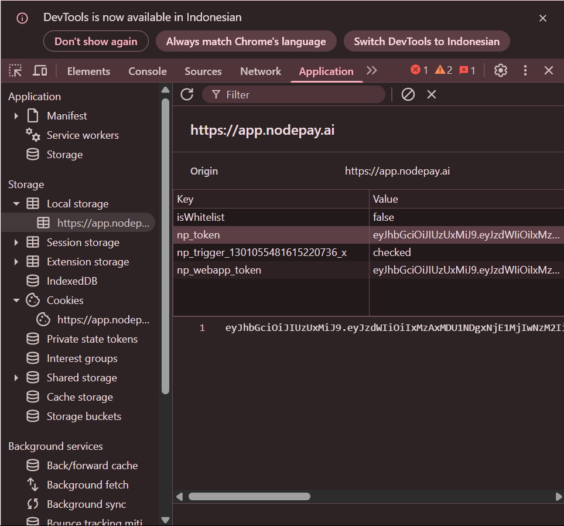

# Nodepay BOT
Nodepay BOT

- Register Here : [Nodepay](https://app.nodepay.ai/register?ref=ydqgY3hNlgl6KaD)
- Use Code `602s4gUlz7hSA98`

## Features
  - Private Turnstile-Solver support
  - Auto Get Account Information
  - Auto Run With [Free Proxyscrape](https://proxyscrape.com/free-proxy-list) Proxy - `Choose 1`
  - Auto Run With Private Proxy - `Choose 2`
  - Auto Run Without Proxy - `Choose 3`
  - Auto Rotate Invalid Proxies - `y` or `n`
  - Auto Claim Daily & Weekly Check-In
  - Auto Send Ping Every 55 Minutes
  - Multi Accounts With Threads

### Note: auto connects 3 Nodes if u using proxies and only 1 if not.

## Requiremnets
- If you have set up a private Turnstile-Solver, please use setup2.py
- Make sure you have Python3.9 or higher installed and pip.
- 2captcha key (optional)

## Instalation

1. **Clone The Repositories:**
   ```bash
   git clone https://github.com/ga440102/Nodepay-BOT.git
   ```
   ```bash
   cd Nodepay-BOT
   ```

2. **Install Requirements:**
   ```bash
   pip install -r requirements.txt #or pip3 install -r requirements.txt
   ```

## Configuration

- **2captcha_key.txt:** You will find the file `2captcha_key.txt` inside the project directory. Make sure `2captcha_key.txt` contains data that matches the format expected by the script. Here are examples of file formats:
  ```bash
    your_2captcha_key
  ```

- **accounts.json:** You will find the file `accounts.json` inside the project directory. Make sure `accounts.json` contains data that matches the format expected by the script. Here are examples of file formats:
  ```json
    [
        {
            "Email": "your_email_address_1",
            "Password": "your_password_1"
        },
        {
            "Email": "your_email_address_2",
            "Password": "your_password_2"
        }
    ]
  ```

### Note

- If you don't have a 2cpatcha key, you can fetch the data manually and put it in tokens.json according to the format.

<div style="text-align: center;">
  
</div>

- **tokens.json:** You will find the file `tokens.json` inside the project directory. Make sure `tokens.json` contains data that matches the format expected by the script. Here are examples of file formats:
  ```json
    [
        {
            "Email": "your_email_address_1",
            "npToken": "your_np_token_1"
        },
        {
            "Email": "your_email_address_2",
            "npToken": "your_np_token_2"
        }
    ]
  ```

- **proxy.txt:** You will find the file `proxy.txt` inside the project directory. Make sure `proxy.txt` contains data that matches the format expected by the script. Here are examples of file formats:
  ```bash
    ip:port # Default Protcol HTTP.
    protocol://ip:port
    protocol://user:pass@ip:port
  ```

## Setup

```bash
python setup.py #or python3 setup.py
```

## Run

```bash
python bot.py #or python3 bot.py
```


